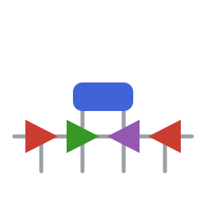

<p align="center">
  
</p>

<h1 align="center">MPSToolkit.jl</h1>

<p align="center">
  <em>Composable finite matrix-product-state algorithms — evolution, projection, operator space, and spectra — in Julia.</em>
</p>

<p align="center">
  <a href="https://jayren3996.github.io/MPSToolkit/dev/"></a>
  <a href="https://github.com/jayren3996/MPSToolkit/actions/workflows/documentation.yml"></a>
  <a href="https://julialang.org/"></a>
  <a href="LICENSE"></a>
</p>

---

`MPSToolkit.jl` is a finite matrix-product-state (MPS) toolkit built on
[`ITensors.jl`](https://itensor.github.io/ITensors.jl/stable/) and
[`ITensorMPS.jl`](https://github.com/ITensor/ITensorMPS.jl). It is organized around explicit,
reusable tensor-network building blocks rather than one opaque driver, so time evolution,
projection, observables, operator-space tools, and spectral routines all stay directly callable
and recombinable.

## 60-Second Demo

Build a Strang-split TEBD schedule from a bond Hamiltonian, evolve a Néel state, and read off two
diagnostics — every ingredient is a separate, public object:

```julia
using MPSToolkit, ITensors, ITensorMPS

# A 12-site transverse-field Ising chain, started in a Néel product state.
nsites = 12
sites  = siteinds("S=1/2", nsites)
psi    = MPS(sites, n -> isodd(n) ? "Up" : "Dn")

# TEBD is an explicit object: an odd–even–odd Strang schedule of local gates built from the
# bond Hamiltonian. Here, 200 sweeps of dt = 0.05 (total evolution time t = 10).
evolution = tebd_strang_evolution(
    nsites, 0.05;
    local_hamiltonian = (bond, weight) ->
        weight * spinhalf_tfim_bond_hamiltonian(nsites, bond; J = 1.0, g = 0.8),
    nstep  = 200,
    maxdim = 32,
    cutoff = 1e-12,
)

evolve!(psi, evolution)         # mutates psi in place and returns it

expect(psi, "Sz")               # staggered order has relaxed toward 0
bond_entropy(psi, nothing)      # half-chain entanglement has grown from 0 to ≈ 1.47
```

The schedule, the gates, the evolution object, and the diagnostics are all separate pieces — swap
any one without rewriting the others.

## What You Can Do With MPSToolkit

- **Dense-gate TEBD** from local Hamiltonians, with explicit odd–even–odd Strang schedules via `tebd_strang_evolution` and `tebd_strang_schedule`
- **MPO-based TDVP** for finite open-boundary `MPS` via `TDVPEvolution`
- **ScarFinder workflows** — explicit projection (`project!`), energy targeting (`match_energy!`), and selector-driven refinement (`scarfinder!`, `trajectory_refine!`)
- **Pauli operator space**: states and gates (`pauli_siteinds`, `pauli_basis_state`, `pauli_gate_from_hamiltonian`) for coherent and open-system evolution
- **Operator-space truncation**: density-matrix truncation (DMT) and DAOE / FDAOE dissipative projectors
- **Chebyshev spectral tools**: moments, energy-window cutoff, Jackson damping, and spectral-function reconstruction
- **Diagnostics**: `energy_density`, `bond_entropy`, `entanglement_spectrum`, and `fidelity_distance`

## Choose Your Path

| If you want to … | Start with |
|---|---|
| Build and run a finite-chain TEBD workflow | [Getting Started](https://jayren3996.github.io/MPSToolkit/dev/getting-started/) → [TEBD and TDVP](https://jayren3996.github.io/MPSToolkit/dev/manual/tebd-tdvp/) |
| Run MPO-based TDVP on a finite OBC `MPS` | [TEBD and TDVP](https://jayren3996.github.io/MPSToolkit/dev/manual/tebd-tdvp/) |
| Study explicit projection-and-refinement loops | [ScarFinder](https://jayren3996.github.io/MPSToolkit/dev/manual/scarfinder/) |
| Work in Pauli operator space | [Operator Space](https://jayren3996.github.io/MPSToolkit/dev/manual/operator-space/) |
| Truncate or dissipate operator space | [DMT](https://jayren3996.github.io/MPSToolkit/dev/manual/dmt/) · [DAOE](https://jayren3996.github.io/MPSToolkit/dev/manual/daoe/) |
| Reconstruct spectral functions | [Chebyshev](https://jayren3996.github.io/MPSToolkit/dev/manual/chebyshev/) |

## Installation

```julia
using Pkg
Pkg.add(url = "https://github.com/jayren3996/MPSToolkit.git")
```

Then load it with `using MPSToolkit`.

## Repository Map

`MPSToolkit` prefers explicit workflows over hidden orchestration. High-level routines like
ScarFinder are deliberately thin wrappers around public building blocks (`evolve!`, `project!`,
`match_energy!`, and the selector scoring helpers), and most user-facing routines mutate their
`MPS`/state argument in place and return it.

| Directory | What lives there |
|---|---|
| [`src/evolution/`](src/evolution) | TEBD and TDVP configuration types (`LocalGateEvolution`, `DMTGateEvolution`, `TDVPEvolution`) and the concrete `evolve!` methods. |
| [`src/scarfinder/`](src/scarfinder) | Projection settings, selector types, the explicit ScarFinder loop, and post-step energy matching. |
| [`src/observables/`](src/observables) | Energy density, entanglement entropy and spectrum, and fidelity-style diagnostics. |
| [`src/operator_space/`](src/operator_space) | Pauli-basis helpers, DMT, and DAOE / FDAOE projectors. |
| [`src/chebyshev/`](src/chebyshev) | Chebyshev moments, energy-window projection, damping kernels, and spectral reconstruction. |
| [`src/models/`](src/models), [`src/bases/`](src/bases) | Small dense helper matrices used by examples and constructors. |

The public surface is grouped into feature namespaces — `MPSToolkit.Evolution`, `.Observables`,
`.ScarFinder`, `.OperatorSpace`, `.Bases`, `.Models`, and `.Chebyshev` — and every name is also
exported from the root module.

## Conventions Worth Knowing

- `evolve!`, `project!`, and `energy_density` are **dispatch points** — check the concrete methods before changing behavior.
- Dense local operators are interpreted through the **local site dimension** of the input `MPS`.
- Operator-space code assumes the local Pauli ordering **`(I, X, Y, Z)`** unless a docstring says otherwise.
- **Finite OBC `MPS`** is the main supported state class; periodic behavior is limited to a few helper cases.
- **ScarFinder step-count guard.** `scarfinder!`, `scarfinder_step!`, and `trajectory_refine!` treat an effective evolution step count of `1` as a misconfiguration: they emit a warning and internally use `10` for that call. This rule is local to ScarFinder — global TEBD, DMT, and TDVP constructors keep their own defaults, and the energy-correction substeps inside `match_energy!` intentionally remain single-step.

## Examples

Runnable notebooks and scripts live in [`examples/`](examples):

- [`examples/tebd/`](examples/tebd) — XXZ TEBD vs ED, disordered-XXZ MBL dynamics, scheduler patterns, helper APIs
- [`examples/scarfinder/`](examples/scarfinder) — PXP ScarFinder, XYZ spiral
- [`examples/operator_space/`](examples/operator_space) — TFIM autocorrelators, operator strings, entanglement, custom Hamiltonians, DMT scheduling
- [`examples/tdvp/`](examples/tdvp) — PBC TDVP vs TEBD
- [`examples/chebyshev/`](examples/chebyshev) — energy-cutoff comparison, two-peak spectra, local spectral functions
- [`examples/open_systems/`](examples/open_systems) — boundary-driven XXZ steady state, Pauli–Lindblad TEBD

## Current Limits

- finite OBC `MPS` is the main supported state class
- periodic chains are not a general supported mode
- `TDVPEvolution` currently expects MPO generators
- DMT is currently implemented for operator-space workflows

## Documentation

- [Documentation (dev)](https://jayren3996.github.io/MPSToolkit/dev/) — the main human-facing reference
- [Getting Started](https://jayren3996.github.io/MPSToolkit/dev/getting-started/)
- [Architecture](https://jayren3996.github.io/MPSToolkit/dev/manual/architecture/)
- [API Reference](https://jayren3996.github.io/MPSToolkit/dev/api/)

## Citation

If `MPSToolkit.jl` is useful in your research, please cite it:

```bibtex
@misc{MPSToolkit_jl,
  author       = {Ren, Jie},
  title        = {{MPSToolkit.jl}: composable finite matrix-product-state algorithms in Julia},
  year         = {2026},
  howpublished = {\url{https://github.com/jayren3996/MPSToolkit}},
}
```

## Acknowledgements

`MPSToolkit.jl` builds directly on the [ITensor](https://itensor.org/) ecosystem —
[`ITensors.jl`](https://github.com/ITensor/ITensors.jl) and
[`ITensorMPS.jl`](https://github.com/ITensor/ITensorMPS.jl) — and on
[`KrylovKit.jl`](https://github.com/Jutho/KrylovKit.jl).

## License

Released under the [MIT License](LICENSE).
